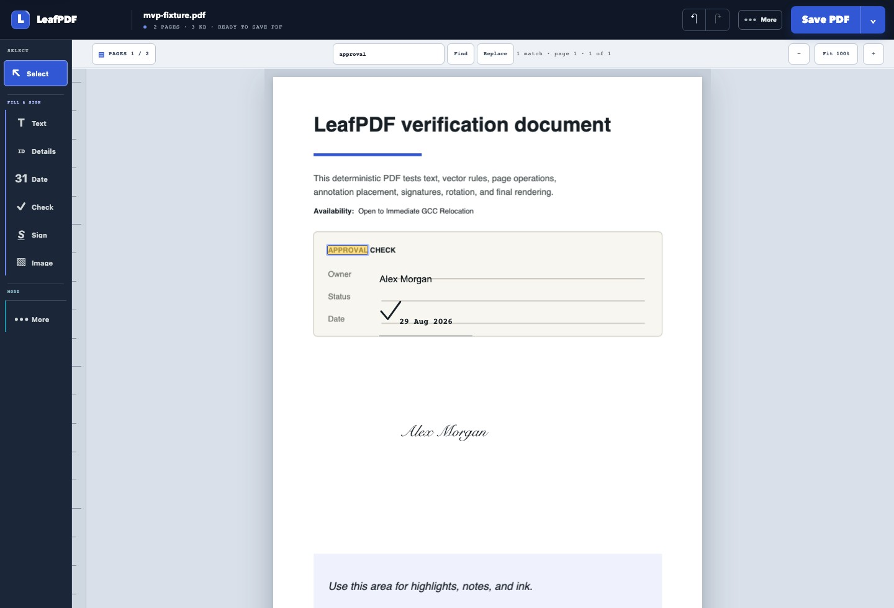

# LeafPDF

[](https://github.com/SyedAkramaIrshad/leafpdf/actions/workflows/ci.yml)
[](LICENSE)
[](#why-leafpdf)

LeafPDF is a free, local-first PDF annotation editor. It opens files entirely in the browser, keeps
the original page content untouched, and exports a new PDF with your additions. Nothing is uploaded
and the original file is never overwritten.

The task-first workspace is organized around the common finishing sequence: text, details,
signature, image, review, and export.


## Why LeafPDF?

Most browser PDF tools require an upload, an account, a subscription, or all three. LeafPDF exists
for the common jobs that should not need any of them: adding text, filling with visual marks,
signing, annotating, arranging pages, and exporting a new copy. PDF processing runs locally in your
browser, the protected source page stays untouched, and the project is open source so its privacy
claims can be inspected rather than merely trusted.



## Quick start

Requirements: Node.js 22 or newer and npm.

```bash
git clone https://github.com/SyedAkramaIrshad/leafpdf.git
cd leafpdf
npm install
npm run dev
```

Open the local URL printed by Vite. No API key, server, database, or environment file is required.

## Included

- PDF file picker and drag-and-drop opening up to 100 MB (measured, see below)
- Continuous scrolling and an on-demand **Pages current / total** organizer with thumbnails, selection,
  rotation, reordering, and deletion. Drag a page's perforated grip to reorder directly with a
  pointer; arrow controls remain available for
  one-step keyboard movement, and the complete drop is one Undo. The organizer overlays the
  workspace instead of permanently shrinking the paper
- Blank-page insertion and merging: every page of another PDF can be inserted after any page
- Real form filling: the source PDF's own AcroForm text fields, checkboxes, radio groups, and
  dropdowns are shown as live inputs and written back into the actual fields on export. Verified
  against a real IRS W-9, an XFA-hybrid form with hierarchical field names; filling drops the
  stale XFA overlay so every viewer shows the filled values. A page-aware **Fields** guide starts
  at the first editable control and moves Previous or Next across pages without treating optional
  blank fields as errors or blocking Save PDF
- Real form creation: choose **Forms** to drag native Text fields, Checkboxes, Radio choices, or
  Dropdowns over a flat PDF. Radio choices can be grouped as mutually exclusive answers, dropdown
  choices keep their entered order, and names, defaults, Required state, projects, recovery,
  copy/paste, and Undo remain editable before export. The saved PDF contains standard AcroForm
  controls that stay fillable in compatible PDF readers; the cobalt blueprint guides are not saved
- Selectable, copyable source text (a pdf.js text layer), plus find-in-document with visible
  occurrence markers and Ctrl/Cmd+F. Previous/Next moves through repeated source matches even on
  one page. Choose **Replace** to correct the active source match or every source match in the
  document; Replace all is one Undo. OCR-only matches remain searchable without invented glyph
  markers and are excluded from automatic replacement. Select source words to get a paper-anchored
  **Replace selected text** action that creates the cover and editable correction together
- Whiteout for visual corrections: select source words and replace them directly, or draw a cover
  manually and choose **Add replacement text**. The original content remains in the file and may
  still be searchable, selectable, or recoverable
- True redaction: a redacted page is exported as a rasterized copy, so the covered content is
  removed from the file, not hidden under a box
- Added text edited directly on the page, with an explicit Done action, Enter-to-finish,
  Shift+Enter line breaks, family, exact 6–96 pt size, colour, bold, and italic controls
- A private My details tray for Full name, Email, Phone, Company, and Address: drafts can be placed
  without saving, while optional reuse is an explicit browser-only choice
- A compact Text marks palette: Highlight fills the dragged area; Underline and Strikeout draw
  precise review lines. All three stay editable before Save PDF. Also includes freehand ink,
  PNG/JPEG images, rectangles, ellipses, lines, and arrows
- Placed-image proofing: use Adjust to change opacity, turn left or right, straighten, or replace a
  local PNG/JPEG while keeping its page position and corrected aspect ratio. Replacement is one Undo
- Clickable web, email, and phone areas: a blue proof layer stays visible while editing, then
  exports as a borderless standard PDF link without changing the page artwork
- Checkmarks, crosses, dots, one-click date stamps with calendar-backed exact output formats,
  editable watermarks, and page numbers
- A type-first signature desk with full-name or initials output, Script, Classic, and Clean local
  styles, Draw and Upload alternatives, and saved-signature shortcuts stored only in this browser
- Fluid selection/dragging previews with page/nearby-item alignment guides, plus four-corner resize;
  visual items can rotate, while link areas stay axis-aligned so editor and PDF hitboxes agree
- Object duplicate, copy/paste, forward/backward layer ordering, properties, and deletion
- Keyboard-only annotation movement: arrow keys nudge by 1%, Shift+Arrow by 5%
- 50-step undo/redo history with keyboard shortcuts, where one typing session is one undo and
  Ctrl/Cmd+Z uses LeafPDF history even while an added text box is focused
- IndexedDB recovery autosave and explicit restore/discard choices, plus unsaved-change protection on close
- Worker-based PDF export with two explicit outputs: the normal `-edited.pdf` copy keeps real form
  controls fillable, while `-flattened.pdf` fixes their current appearances into the pages and
  removes the controls. Flattening is not encryption or tamper-proofing
- Laptop/desktop editor for viewports 1024 px and wider, with keyboard-accessible menus/dialogs,
  focus indicators, and reduced-motion support

## Explicitly not included yet

- Directly mutating or reflowing existing source-PDF text objects (visual select-to-replace is supported)
- Internal page-to-page link creation (external web, email, and phone links are supported)
- Multi-select list boxes and non-Latin text in filled form fields (the form's own fonts store
  WinAnsi text only; LeafPDF refuses by field name rather than dropping the value)
- Decrypting encrypted PDFs. This includes the very common permissions-only lock with an empty
  password: such a file opens and reads normally in LeafPDF, with a banner explaining that
  exporting is disabled, because writing an edited copy would require decrypting it.
- Password encryption, certificate-based digital signatures, PDF/A or PDF/UA conformance
- Chinese, Japanese, and Korean text in added text (source text in those scripts still renders
  normally because the source page is untouched)
- Cloud storage, accounts, collaboration, or telemetry

Redaction is real but has a stated cost: the redacted page is converted to a picture, so its text
is no longer selectable and the file grows by the size of that image. This is the honest trade
for a removal that cannot be reversed; a black box over live text is exactly what LeafPDF
previously refused to call redaction.

Whiteout is deliberately different. It adds an opaque white rectangle for a visual correction,
and the faint outline shown while editing is not saved. The source text or image stays underneath.
With **Select** active, select the source words and choose **Replace selected text**; type the
correction, then press **Enter** or choose **Done**. The cover and first typing run are one history
entry, so one **Undo** removes the complete initial correction. For manual placement, use
**Whiteout**, then choose **Add replacement text**. Use **Redact** instead whenever the underlying
content must be removed permanently.

For repeated corrections, Find the source phrase and choose **Replace**. Enter the new text, then
choose **Replace this match** or **Replace all source matches**. LeafPDF moves through exact source
occurrences across pages and keeps the complete Replace all batch in one Undo step. This still uses
Whiteout plus editable text: the original phrase remains searchable underneath. OCR-only results do
not expose reliable source glyph boxes, so LeafPDF reports them but never invents replacement geometry.

A typed, drawn, or uploaded signature is rasterized as a visual mark; it is not a certificate-backed
cryptographic signature. The Type method can render a normalized full name or initials in three
locally available style stacks, and reuse remains an explicit browser-only choice. If the source PDF
carries a digital signature, LeafPDF says so before you edit: any edit invalidates that signature,
and LeafPDF cannot re-sign a document.

Recovery saves only LeafPDF's compact page/annotation model in browser IndexedDB; it never saves the
source PDF bytes. A record is keyed by the source PDF's stable PDF.js fingerprint as well as file
metadata, so edits are not offered for a different file that happens to share a name and size.
Recovery writes and deletions are serialized to prevent a delayed autosave from resurrecting a
discarded session. Exporting the current document clears its recovery record; edits made while an
export is building remain dirty and are immediately preserved for a later export.

Added text behaves like a small text box on the page: click it and type there. The blue grip above a
selected text box moves it. Font size shows its exact point value and supports direct typing,
plus/minus buttons, arrow keys, and the mouse wheel. Drag and resize gestures preview continuously
but enter history as one change, so a single Undo reverses the whole gesture.

To correct existing words without building a cover and text box separately, keep **Select** active,
drag across source text, and use the **Replace selected text** proof tab beside the selection. The
selected words are prefilled and selected for immediate typing. This is an honest visual correction:
the properties slip always warns that the source remains underneath and may still be found or copied.

Before **Save PDF**, LeafPDF checks for added text that is empty or still says **Type here**. It
returns you to the first unfinished item by default, while **Save anyway** remains available when
that literal text is intentional. A link with an empty, malformed, or unsafe destination instead
blocks the save with no bypass; only `http`, `https`, `mailto`, and `tel` destinations are written.
Nothing is silently deleted or rewritten.

While editing added text, press **Enter** or **Escape** to finish and deselect it. Use
**Shift+Enter** for a new line. The properties panel also keeps a visible **Done** button available.
**Ctrl/Cmd+Z** and **Ctrl/Cmd+Shift+Z** always use LeafPDF's document history, including when the
text caret is active, so undoing a paste removes the pasted object instead of silently rewriting a
different text box. Object Copy, Paste, and Duplicate stay inside LeafPDF and announce what they
created; the operating-system clipboard is unchanged.

**My details** is a local quick-fill tray, not an account profile. Type a Full name, Email, Phone,
Company, or Address and choose **Place** to put that literal value on the paper as ordinary editable
text. Draft values work without saving. **Save on this device** is explicit and stores the reusable
profile only in this browser; only values you actually place enter recovery, `.leafpdf` projects, or
saved PDFs. **Clear saved details** removes the reusable profile after confirmation and does not
remove text already placed in an open document.

After placing an **Image**, select it and choose **Adjust**. Opacity affects only the bitmap—not its
selection handles. Turn left/right or Straighten gives precise orientation, and **Replace image**
swaps in another local PNG/JPEG while keeping the visual centre and new aspect ratio. The file never
leaves the browser, and one Undo restores the previous image and geometry.

The editing dock follows the usual finishing sequence: **Select**, **Text**, **Date**, **Check**,
**Sign**, and **Image** are all one-click actions. **Details** follows them as an optional local
quick-fill tray. **Text marks** groups Highlight, Underline, and Strikeout: Highlight fills an area,
while Underline and Strikeout draw precise lines; select any mark to adjust it before Save PDF. Drawing, shapes,
**More marks** (Cross and Dot), **Link**, **Whiteout**, and **Redact** follow as secondary tools.
Selecting an added item keeps the paper in place and opens a compact proofing slip. **Adjust** reveals
its controls, **Hide** returns to the paper-first view, and **Done** clears the selection.
**Pages current / total** opens the page organizer on laptop and desktop. It contains
thumbnails plus blank-page, insert-PDF, move, rotate, and delete actions, then closes when you choose
a page so the paper gets the workspace back. Drag the perforated grip on a thumbnail to preview a
new order and release once to commit it; ↑ and ↓ remain the keyboard-friendly precision controls.
**Save PDF** stays prominent in the top bar. **Save project**, Review, Privacy, OCR, Compare, and
watermark/page-number controls are grouped under **More tools**.

When a placement tool is active, the page says whether to click or drag and **Escape** cancels it.
Date remains a one-click placement tool. Select the placed date to choose a Calendar date and one of
four literal printed formats—Day month, Month day, Day first, or ISO—or type any wording in Date
text. The visible label is exactly what Save PDF prints, so old and custom dates remain valid.
**Sign** opens on Type with the name field ready, lets you choose full name or initials plus Script,
Classic, or Clean, and puts saved local signatures above the creation methods for one-click reuse.

For a clickable area, choose **Link**, drag over the words or image that should respond, then select
Web address, Email, or Phone and enter the destination. The striped cobalt `LINK` proof is editor-only;
the saved page remains visually unchanged while standard PDF readers receive a borderless `/Link`
annotation. Bare web domains are normalized to HTTPS, and unsafe schemes such as `javascript:`,
`data:`, and `file:` are refused before export.

Images and signatures are prepared before they change the project. Move over the PDF to preview the
exact footprint, then click where the image or signature belongs. Their original proportions are
preserved in both the editor and the saved PDF, and every blue corner handle keeps those proportions
locked while resizing. Press **Enter** to place one in the center of the current page, or **Escape**
to cancel without creating an undo step or unsaved edit.

While dragging an added item, LeafPDF settles its edges or center onto nearby page and item alignment
when they are close. Hold **Option/Alt** while dragging to move freely without guides. Arrow-key
nudge remains exact and unsnapped for deliberate 1% or 5% adjustments.

The desktop workspace opens at 100%. Use − or + for manual zoom, or choose **Fit width** whenever the
complete paper should fill the available document area. Opening or hiding the compact properties slip
never changes export coordinates or creates an undo step.

Keyboard users can Tab to **Skip to PDF** or **Skip to item properties** instead of crossing every
toolbar control. The open filename is the workspace heading, pages and properties have named
sections, and native file pickers do not add duplicate stops after their visible action buttons.
On PDFs with a detected AcroForm, **Fields** opens a compact locator for Start, Previous, and Next;
it follows the current page order and hands focus to the real text, checkbox, radio, or dropdown
control. Native Tab navigation continues from there. Read-only, unsupported, inserted-page, and
blank-page controls are skipped, while optional unfilled controls remain optional.

**More → Help & shortcuts** repeats the finishing sequence inside the editor and explains three
outputs: **Save project** keeps a portable editable `.leafpdf` project for later; the main
**Save PDF** action creates a fillable `.pdf`; and its adjacent output menu offers a flattened
`.pdf` whose current form appearances remain visible without editable form controls. Flattening
does not encrypt or make the PDF tamper-proof. Press **?** outside a text field to open the same guide.

## What export preserves

LeafPDF chooses an export path from what it finds in the source PDF.

**Fillable or flattened.** The default output keeps standard AcroForm controls so the PDF can be
filled again. The optional flattened output first updates current form appearances, paints them
into the pages, and removes the controls. Added text, signatures, images, links, comments, and page
operations follow the same export path in either mode. XFA forms are not flattened because pdf-lib
cannot paint them safely; LeafPDF stops instead of silently deleting that form data.

**Preserved.** When your pages stay in their original order, LeafPDF edits the source document in
place rather than rebuilding it. Because the catalog is never rebuilt, *everything* survives
untouched — metadata, bookmarks, attachments, form fields, tagged-PDF structure, layers, and any
feature LeafPDF does not itself understand. Deleting pages also takes this path when the document has
nothing that could end up referencing a removed page.

**Rebuilt.** Reordering pages cannot be expressed without rebuilding the document, and a rebuild
copies pages into a fresh catalog. Title, author, subject, keywords, creator, creation date,
`/Lang`, `/PageMode`, and `/PageLayout` are copied across explicitly.

**Inserted pages.** A blank page or a page from another PDF is inserted in place when the source
has no catalog feature that could be invalidated, keeping everything else intact. The inserted
PDF's own bookmarks and form fields are not carried over, and the insert dialog says so.

**Redaction.** Any redaction forces a rebuild, because only a rebuild guarantees the redacted
page's original objects never reach the output; the compatibility confirmation applies as usual
when the source has features to lose.

**Blocked pending your confirmation.** If reordering, deleting, or inserting a page would drop or invalidate
something, LeafPDF stops and names exactly what is at risk before you decide. It checks for
bookmarks, form fields, attachments, digital signatures, tagged-PDF structure, page labels, optional
content layers, named destinations, document JavaScript, open/additional actions, XMP metadata,
viewer preferences, article threads, portfolio collections, viewer requirements, permissions, and
legal attestations. You choose between cancelling and exporting a "compatibility copy" that keeps
your page order and edits but loses those features. Your original file is never modified either way.

Detection also covers **page-level** features, not just the catalog: a link from one page to another
is found by walking each page's annotations, because deleting or moving the target page would leave
that link pointing at the wrong page. Plain external web links are not flagged, since reordering
cannot break them.

**The honest limit of that list.** Detection is a known-key check, not a proof. A catalog entry that
is not in the list above and is not one of the copied entries would be lost on a rebuild without
being named — so "nothing is lost silently" holds for the preservation path, and for the rebuild
path only as far as the list reaches. If you need a guarantee, avoid reordering and deleting pages:
that path rebuilds nothing and therefore loses nothing.

## Size and performance limits

A generated 98.6 MB / 43-page PDF of incompressible images opens in about 1.5 seconds and
exports in about 0.6 seconds with no console errors, in the Playwright Chromium build on one
machine. Those timings are reproducible.

**Memory is not measured, and cannot be with the tooling here.** An earlier version of
this file claimed a ~228 MB peak. That number came from `performance.memory`, and it is
withdrawn: the same code path reported 228 MB and 17 MB depending only on when the
sample was taken, because a PDF's bytes live in `ArrayBuffer` storage that is external
to `usedJSHeapSize`. The instrument cannot see the allocation in question. Nor can the
export worker be measured: `performance.memory` does not exist in a dedicated worker,
CDP `SystemInfo.getProcessInfo` reports no memory, and `Performance.getMetrics` covers
only the page's own isolate. So treat 100 MB as *"opens and exports without error at
this size"*, not as a memory guarantee.

What is known by inspection rather than measurement: opening a file allocates one
main-thread copy of it (`file.arrayBuffer()` in `loadPdf.ts`), which PDF.js then
transfers to its own worker; and export re-reads the file inside the export worker, so
that second read never touches the main thread.

The fixture is roughly 100 MB and is not kept in the tree, so the large-file test
**skips** by default — a normal `npm run test:e2e` does not re-verify this limit:

```bash
npm run test:e2e:large
```

That generates the fixture and runs the test. Do it before trusting or raising the limit.

Export runs on a Web Worker, so the interface keeps responding while pdf-lib works. A
100-page export leaves a 100 ms page timer ticking with no gap longer than about
110 ms — a blocking export would show a single gap as long as the whole export. The
worker also does the structural analysis at open time, reading the file itself, so that
parse never runs on the main thread. Opening still allocates one main-thread copy of the
file to hand to PDF.js — see the note on memory below.

pdf-lib, fontkit, and the bundled fonts are loaded only inside that worker, and only
when actually needed: the landing page ships about 195 kB of JavaScript, and an export
of plain Latin text downloads no font file at all.

Very large individual pages are capped at roughly 16 megapixels of canvas; above that
the preview is rendered at reduced scale and says so. Export coordinates are taken
from the CSS viewport, so a reduced preview never changes the exported result.

## Unicode and fonts

Text you add is exported with a real embedded font, so it is not limited to WinAnsi.
Latin, Greek, Cyrillic, Arabic, Devanagari, Hebrew, and Thai are supported, with proper shaping —
Arabic letters join and Devanagari conjuncts form correctly. Fonts are bundled with the application under the SIL
Open Font License (see `src/assets/fonts/README.md`), loaded from LeafPDF's own build output only
when an export needs them, and never fetched from Google or any other host at runtime.

Scripts with no bundled font — Chinese, Japanese, Korean, and others — are not supported yet. Rather than exporting blank boxes, LeafPDF refuses the export and names the text it
cannot draw. Ordinary Latin text still uses the standard PDF fonts and embeds nothing.

Italic is exported using the standard italic and oblique faces, so it survives for ASCII and
Latin-1 text. The bundled Noto files are upright only, so italic text that needs an embedded font
(Cyrillic, Arabic, Devanagari, or anything with an em dash or curly quote) exports upright. Bold is
supported in both paths.

Existing page content is deliberately not editable. It is rendered as a protected background; only
content added in LeafPDF is selected and changed. Whiteout can cover part of that background visually,
but it does not edit or remove the underlying object. This keeps complicated source typography and
layout intact without pretending that a visual cover-up is a real text edit.

## Run locally

```bash
git clone https://github.com/SyedAkramaIrshad/leafpdf.git
cd leafpdf
npm install
npm run dev
```

Open the local URL printed by Vite, choose a PDF, annotate it, and use **Save PDF**.

## Verify

```bash
npm run lint
npm test
npm run build
```

For the browser and PDF round-trip tests, first generate the deterministic fixtures with
a Python environment containing ReportLab and pypdf:

```bash
python3 scripts/create-fixture.py
python3 scripts/create-edge-fixtures.py
npm run test:e2e
```

The edge fixtures cover portrait and landscape pages, all four `/Rotate` values,
metadata, bookmarks, attachments, an AcroForm field, a signature field, an image-only
"scanned" page, whitespace-only text, and a 100-page document. Tests that need a
fixture skip themselves when it is absent rather than failing.

The large-file fixture is generated separately because it is about 100 MB and is not
kept in the tree:

```bash
python3 scripts/create-large-fixture.py 78
```

The browser tests save their exported PDFs under `output/pdf/`.

`e2e/real-world.spec.ts` additionally exercises two real documents that are not committed — the
IRS W-9 (an XFA-hybrid form) and the 756-page, permissions-encrypted PDF 32000 specification.
Those tests skip themselves unless the files are fetched from their official sources:

```bash
mkdir -p tmp/pdfs/real
curl -sSLo tmp/pdfs/real/fw9.pdf https://www.irs.gov/pub/irs-pdf/fw9.pdf
curl -sSLo tmp/pdfs/real/pdf-spec.pdf https://opensource.adobe.com/dc-acrobat-sdk-docs/pdfstandards/PDF32000_2008.pdf
```

The same suite also runs against the production build — the artifact users actually get, with its
Content-Security-Policy meta tag active — by setting one variable:

```bash
LEAFPDF_E2E_SERVER=preview npm run test:e2e
```

CI runs lint, unit tests, the build, the verifier self-test, and the full browser suite in both
server modes on every push and pull request.

### Verifying an exported PDF

`scripts/verify_export.py` reopens an export with pypdf, checks page count, rotations, `/Producer`,
metadata, AcroForm fields, attachments, and outlines against the source, then renders every page with
Poppler and rejects blank or missing renders. It exits non-zero on any failure, so it can gate a
release.

```bash
python3 scripts/verify_export.py tmp/pdfs/mvp-fixture.pdf output/pdf/mvp-fixture-edited.pdf
```

The verifier has its own self-test, because a verifier that never fails is worthless. It builds
deliberately broken exports — a blank page, a foreign `/Producer`, dropped metadata, too many pages, a
missing file — and asserts each one is rejected with the right exit code:

```bash
npm run verify:self-test
```

That is how the blank-page check is known to work: a blank A4 page renders to about 2.6 kB, so the
previous file-size threshold passed it, while the current pixel-based check rejects it and still
accepts a page holding one short line of text.

For an export the user accepted as a compatibility copy, pass `--expect-compatibility-copy`: catalog
features are then allowed to be absent, but metadata is still required to have been copied.

For an export with inserted pages, declare the expected total with `--expect-pages N` — without it,
more pages than the source is a failure. User-inserted blank pages are declared with
`--allow-blank-pages`, since the blank-render check cannot tell an intentional blank from a broken
one:

```bash
python3 scripts/verify_export.py tmp/pdfs/mvp-fixture.pdf output/pdf/mvp-with-insertions.pdf --expect-pages 5 --allow-blank-pages 2
```

```bash
python3 scripts/verify_export.py tmp/pdfs/edge-form.pdf output/pdf/edge-form-compatibility-copy.pdf --expect-compatibility-copy
```

## Implementation

- React and TypeScript provide the editor interface and immutable session history.
- PDF.js renders the protected source pages on its own worker. A superseded render is cancelled
  rather than left to race the next one.
- pdf-lib mutates, orders, rotates, annotates, and exports pages, and `@pdf-lib/fontkit` embeds and
  shapes bundled Unicode fonts. All of this runs on a dedicated export worker, never the UI thread.
- PDF.js, pdf-lib, fontkit, and each font load only when needed; off-screen thumbnails render lazily.
- Vitest covers state, transform geometry, real IndexedDB persistence, recovery ordering, fonts,
  source analysis, export, the worker protocol, dialogs, palettes, and UI controls. Some tests read
  generated fixtures and skip when those are absent.
- Playwright covers real browser workflows: source-text replacement with one-step keyboard undo,
  every shape and fill symbol, all three signature modes, typed initials and styles,
  reusable signatures, the signature desk, transforms, object layers, watermarks, page numbers,
  recovery, final export, the 1024 px minimum-width workspace, text formatting,
  page-operation confirmation, keyboard movement, modal focus,
  unsaved-change protection, UI responsiveness during export, and an assertion that no request ever
  leaves the test origin.
- `scripts/verify_export.py` provides structural and render verification outside the browser.
- The production build carries a Content-Security-Policy meta tag that allows no other host for
  any resource, so the browser enforces the no-network promise rather than merely trusting the code.
- Redacted pages are rasterized on the main thread (pdf.js needs a canvas) and replaced outright
  during the worker rebuild; the export refuses to run if a redacted page's bitmap is missing.

The PDF.js worker is still a substantial download because it is the offline document renderer, but it
no longer blocks the initial landing-page bundle, which is about 195 kB.

Note for contributors: never leave a compiled `vite.config.js` in the project root. Vite resolves the
`.js` name before `.ts`, so a stale one silently becomes the real configuration.

## Contributing

Issues and pull requests are welcome. Read [CONTRIBUTING.md](CONTRIBUTING.md) for the development and
verification workflow. Please use GitHub's private security-advisory flow for vulnerabilities; see
[SECURITY.md](SECURITY.md). Maintainers should use [RELEASING.md](RELEASING.md) for the full static,
browser, PDF, privacy, visual, and artifact gate before tagging a release. The provider-neutral root
and subpath deployment contract is documented in [HOSTING.md](HOSTING.md).

## License

LeafPDF is available under the [MIT License](LICENSE). The bundled Noto fonts retain their own SIL
Open Font License; see [src/assets/fonts/OFL.txt](src/assets/fonts/OFL.txt).
