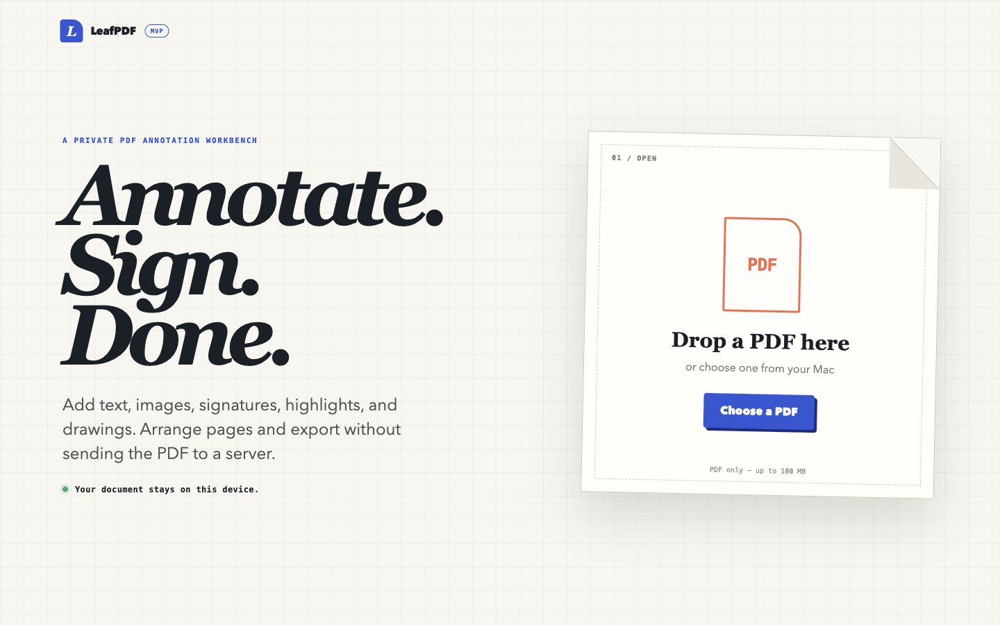
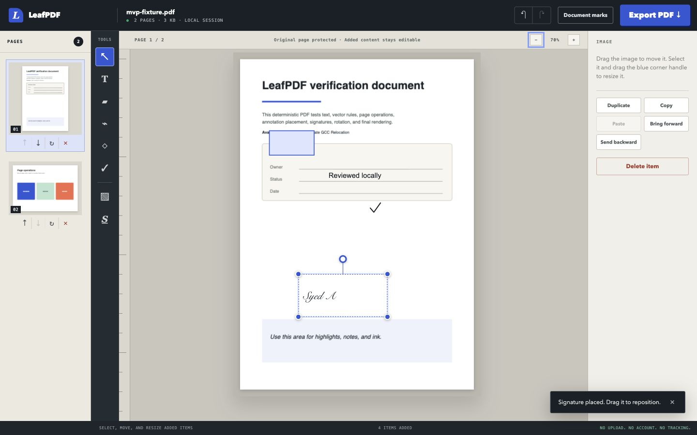

# LeafPDF

[](https://github.com/SyedAkramaIrshad/leafpdf/actions/workflows/ci.yml)
[](LICENSE)
[](#why-leafpdf)

LeafPDF is a free, local-first PDF annotation editor. It opens files entirely in the browser, keeps
the original page content untouched, and exports a new PDF with your additions. Nothing is uploaded
and the original file is never overwritten.



## Why LeafPDF?

Most browser PDF tools require an upload, an account, a subscription, or all three. LeafPDF exists
for the common jobs that should not need any of them: adding text, filling with visual marks,
signing, annotating, arranging pages, and exporting a new copy. PDF processing runs locally in your
browser, the protected source page stays untouched, and the project is open source so its privacy
claims can be inspected rather than merely trusted.



## Quick start

Requirements: Node.js 22 or newer and npm.

```bash
git clone https://github.com/SyedAkramaIrshad/leafpdf.git
cd leafpdf
npm install
npm run dev
```

Open the local URL printed by Vite. No API key, server, database, or environment file is required.

## Included

- PDF file picker and drag-and-drop opening up to 100 MB (measured, see below)
- Multi-page rendering, page thumbnails, selection, zoom, rotation, reordering, and deletion
- Added text edited directly on the page, with family, exact 6–96 pt size, colour, bold, and italic controls
- Highlight, freehand ink, PNG/JPEG images, rectangles, ellipses, lines, and arrows
- Checkmarks, crosses, dots, date stamps, editable watermarks, and page numbers
- Drawn, typed, and uploaded signatures, with optional reusable signatures stored only in this browser
- Fluid selection/dragging previews plus four-corner resize and rotation for every added item
- Object duplicate, copy/paste, forward/backward layer ordering, properties, and deletion
- Keyboard-only annotation movement: arrow keys nudge by 1%, Shift+Arrow by 5%
- 50-step undo/redo history with keyboard shortcuts, where one typing session is one undo
- IndexedDB recovery autosave and explicit restore/discard choices, plus unsaved-change protection on close
- Worker-based PDF export under an `-edited.pdf` filename
- Responsive editor layout down to 320 px, keyboard-accessible menus/dialogs, focus indicators, and reduced-motion support

## Explicitly not included yet

- Editing, removing, or reflowing existing text inside the source PDF
- OCR for scanned PDFs
- Secure content redaction. Covering text with a filled rectangle hides it visually but does not
  remove it, so LeafPDF must not be used to redact sensitive information.
- Filling and preserving every AcroForm/XFA variant
- Password encryption, certificate-based digital signatures, PDF/A or PDF/UA conformance
- Chinese, Japanese, Korean, Hebrew, and Thai text in added text (source text in those scripts still
  renders normally because the source page is untouched)
- Cloud storage, accounts, collaboration, or telemetry

A drawn signature is a visual mark; it is not a certificate-backed cryptographic signature. If the
source PDF carries a digital signature, LeafPDF says so before you edit: any edit invalidates that
signature, and LeafPDF cannot re-sign a document.

Recovery saves only LeafPDF's compact page/annotation model in browser IndexedDB; it never saves the
source PDF bytes. A record is keyed by the source PDF's stable PDF.js fingerprint as well as file
metadata, so edits are not offered for a different file that happens to share a name and size.
Recovery writes and deletions are serialized to prevent a delayed autosave from resurrecting a
discarded session. Exporting the current document clears its recovery record; edits made while an
export is building remain dirty and are immediately preserved for a later export.

Added text behaves like a small text box on the page: click it and type there. The blue grip above a
selected text box moves it. Font size shows its exact point value and supports direct typing,
plus/minus buttons, arrow keys, and the mouse wheel. Drag and resize gestures preview continuously
but enter history as one change, so a single Undo reverses the whole gesture.

## What export preserves

LeafPDF chooses an export path from what it finds in the source PDF.

**Preserved.** When your pages stay in their original order, LeafPDF edits the source document in
place rather than rebuilding it. Because the catalog is never rebuilt, *everything* survives
untouched — metadata, bookmarks, attachments, form fields, tagged-PDF structure, layers, and any
feature LeafPDF does not itself understand. Deleting pages also takes this path when the document has
nothing that could end up referencing a removed page.

**Rebuilt.** Reordering pages cannot be expressed without rebuilding the document, and a rebuild
copies pages into a fresh catalog. Title, author, subject, keywords, creator, creation date,
`/Lang`, `/PageMode`, and `/PageLayout` are copied across explicitly.

**Blocked pending your confirmation.** If reordering or deleting a page would drop or invalidate
something, LeafPDF stops and names exactly what is at risk before you decide. It checks for
bookmarks, form fields, attachments, digital signatures, tagged-PDF structure, page labels, optional
content layers, named destinations, document JavaScript, open/additional actions, XMP metadata,
viewer preferences, article threads, portfolio collections, viewer requirements, permissions, and
legal attestations. You choose between cancelling and exporting a "compatibility copy" that keeps
your page order and edits but loses those features. Your original file is never modified either way.

Detection also covers **page-level** features, not just the catalog: a link from one page to another
is found by walking each page's annotations, because deleting or moving the target page would leave
that link pointing at the wrong page. Plain external web links are not flagged, since reordering
cannot break them.

**The honest limit of that list.** Detection is a known-key check, not a proof. A catalog entry that
is not in the list above and is not one of the copied entries would be lost on a rebuild without
being named — so "nothing is lost silently" holds for the preservation path, and for the rebuild
path only as far as the list reaches. If you need a guarantee, avoid reordering and deleting pages:
that path rebuilds nothing and therefore loses nothing.

## Size and performance limits

A generated 98.6 MB / 43-page PDF of incompressible images opens in about 1.5 seconds and
exports in about 0.6 seconds with no console errors, in the Playwright Chromium build on one
machine. Those timings are reproducible.

**Memory is not measured, and cannot be with the tooling here.** An earlier version of
this file claimed a ~228 MB peak. That number came from `performance.memory`, and it is
withdrawn: the same code path reported 228 MB and 17 MB depending only on when the
sample was taken, because a PDF's bytes live in `ArrayBuffer` storage that is external
to `usedJSHeapSize`. The instrument cannot see the allocation in question. Nor can the
export worker be measured: `performance.memory` does not exist in a dedicated worker,
CDP `SystemInfo.getProcessInfo` reports no memory, and `Performance.getMetrics` covers
only the page's own isolate. So treat 100 MB as *"opens and exports without error at
this size"*, not as a memory guarantee.

What is known by inspection rather than measurement: opening a file allocates one
main-thread copy of it (`file.arrayBuffer()` in `loadPdf.ts`), which PDF.js then
transfers to its own worker; and export re-reads the file inside the export worker, so
that second read never touches the main thread.

The fixture is roughly 100 MB and is not kept in the tree, so the large-file test
**skips** by default — a normal `npm run test:e2e` does not re-verify this limit:

```bash
npm run test:e2e:large
```

That generates the fixture and runs the test. Do it before trusting or raising the limit.

Export runs on a Web Worker, so the interface keeps responding while pdf-lib works. A
100-page export leaves a 100 ms page timer ticking with no gap longer than about
110 ms — a blocking export would show a single gap as long as the whole export. The
worker also does the structural analysis at open time, reading the file itself, so that
parse never runs on the main thread. Opening still allocates one main-thread copy of the
file to hand to PDF.js — see the note on memory below.

pdf-lib, fontkit, and the bundled fonts are loaded only inside that worker, and only
when actually needed: the landing page ships about 195 kB of JavaScript, and an export
of plain Latin text downloads no font file at all.

Very large individual pages are capped at roughly 16 megapixels of canvas; above that
the preview is rendered at reduced scale and says so. Export coordinates are taken
from the CSS viewport, so a reduced preview never changes the exported result.

## Unicode and fonts

Text you add is exported with a real embedded font, so it is not limited to WinAnsi.
Latin, Greek, Cyrillic, Arabic, and Devanagari are supported, with proper shaping — Arabic letters
join and Devanagari conjuncts form correctly. Fonts are bundled with the application under the SIL
Open Font License (see `src/assets/fonts/README.md`), loaded from LeafPDF's own build output only
when an export needs them, and never fetched from Google or any other host at runtime.

Scripts with no bundled font — Chinese, Japanese, Korean, Hebrew, Thai, and others — are not
supported yet. Rather than exporting blank boxes, LeafPDF refuses the export and names the text it
cannot draw. Ordinary Latin text still uses the standard PDF fonts and embeds nothing.

Italic is exported using the standard italic and oblique faces, so it survives for ASCII and
Latin-1 text. The bundled Noto files are upright only, so italic text that needs an embedded font
(Cyrillic, Arabic, Devanagari, or anything with an em dash or curly quote) exports upright. Bold is
supported in both paths.

Existing page content is deliberately not editable. It is rendered as a protected background; only
content added in LeafPDF is selected and changed. This avoids pretending that a visual cover-up is a
real text edit and keeps complicated source typography and layout intact.

## Run locally

```bash
git clone https://github.com/SyedAkramaIrshad/leafpdf.git
cd leafpdf
npm install
npm run dev
```

Open the local URL printed by Vite, choose a PDF, annotate it, and use **Export PDF**.

## Verify

```bash
npm test
npm run build
```

For the browser and PDF round-trip tests, first generate the deterministic fixtures with
a Python environment containing ReportLab and pypdf:

```bash
python3 scripts/create-fixture.py
python3 scripts/create-edge-fixtures.py
npm run test:e2e
```

The edge fixtures cover portrait and landscape pages, all four `/Rotate` values,
metadata, bookmarks, attachments, an AcroForm field, a signature field, an image-only
"scanned" page, whitespace-only text, and a 100-page document. Tests that need a
fixture skip themselves when it is absent rather than failing.

The large-file fixture is generated separately because it is about 100 MB and is not
kept in the tree:

```bash
python3 scripts/create-large-fixture.py 78
```

The browser tests save their exported PDFs under `output/pdf/`.

### Verifying an exported PDF

`scripts/verify_export.py` reopens an export with pypdf, checks page count, rotations, `/Producer`,
metadata, AcroForm fields, attachments, and outlines against the source, then renders every page with
Poppler and rejects blank or missing renders. It exits non-zero on any failure, so it can gate a
release.

```bash
python3 scripts/verify_export.py tmp/pdfs/mvp-fixture.pdf output/pdf/mvp-fixture-edited.pdf
```

The verifier has its own self-test, because a verifier that never fails is worthless. It builds
deliberately broken exports — a blank page, a foreign `/Producer`, dropped metadata, too many pages, a
missing file — and asserts each one is rejected with the right exit code:

```bash
npm run verify:self-test
```

That is how the blank-page check is known to work: a blank A4 page renders to about 2.6 kB, so the
previous file-size threshold passed it, while the current pixel-based check rejects it and still
accepts a page holding one short line of text.

For an export the user accepted as a compatibility copy, pass `--expect-compatibility-copy`: catalog
features are then allowed to be absent, but metadata is still required to have been copied.

```bash
python3 scripts/verify_export.py tmp/pdfs/edge-form.pdf output/pdf/edge-form-compatibility-copy.pdf --expect-compatibility-copy
```

## Implementation

- React and TypeScript provide the editor interface and immutable session history.
- PDF.js renders the protected source pages on its own worker. A superseded render is cancelled
  rather than left to race the next one.
- pdf-lib mutates, orders, rotates, annotates, and exports pages, and `@pdf-lib/fontkit` embeds and
  shapes bundled Unicode fonts. All of this runs on a dedicated export worker, never the UI thread.
- PDF.js, pdf-lib, fontkit, and each font load only when needed; off-screen thumbnails render lazily.
- Vitest covers state, transform geometry, real IndexedDB persistence, recovery ordering, fonts,
  source analysis, export, the worker protocol, dialogs, palettes, and UI controls. Some tests read
  generated fixtures and skip when those are absent.
- Playwright covers real browser workflows: every shape and fill symbol, all three signature modes,
  reusable signatures, transforms, object layers, watermarks, page numbers, recovery, final export,
  320 px access, text formatting, page-operation confirmation, keyboard movement, modal focus,
  unsaved-change protection, UI responsiveness during export, and an assertion that no request ever
  leaves the test origin.
- `scripts/verify_export.py` provides structural and render verification outside the browser.

The PDF.js worker is still a substantial download because it is the offline document renderer, but it
no longer blocks the initial landing-page bundle, which is about 195 kB.

Note for contributors: never leave a compiled `vite.config.js` in the project root. Vite resolves the
`.js` name before `.ts`, so a stale one silently becomes the real configuration.

## Contributing

Issues and pull requests are welcome. Read [CONTRIBUTING.md](CONTRIBUTING.md) for the development and
verification workflow. Please use GitHub's private security-advisory flow for vulnerabilities; see
[SECURITY.md](SECURITY.md).

## License

LeafPDF is available under the [MIT License](LICENSE). The bundled Noto fonts retain their own SIL
Open Font License; see [src/assets/fonts/OFL.txt](src/assets/fonts/OFL.txt).
